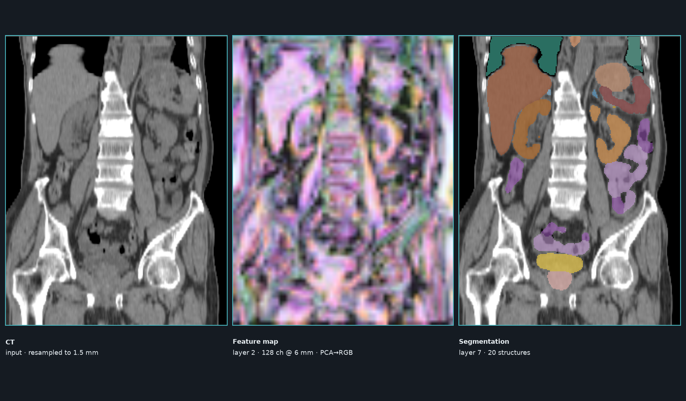
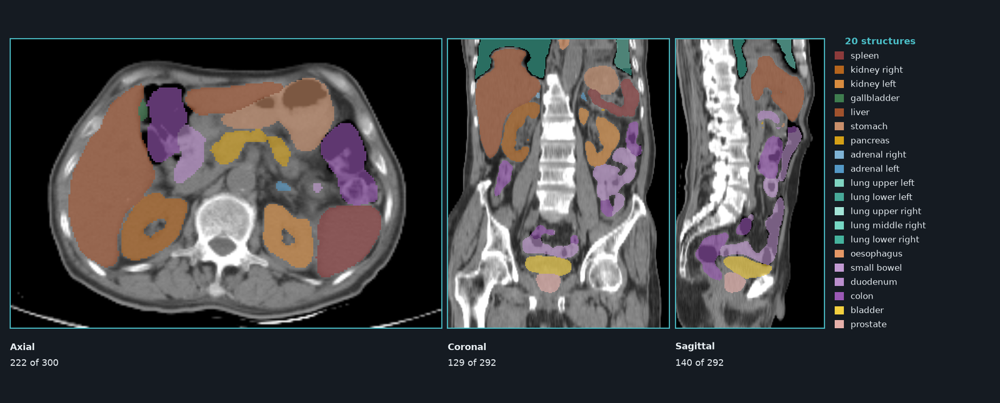
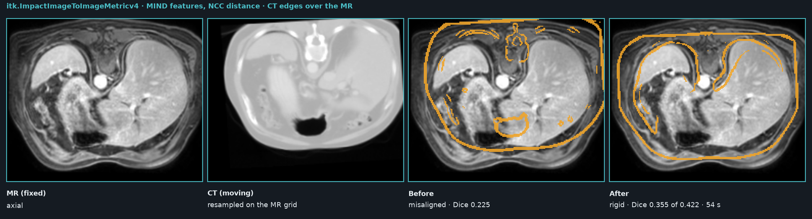
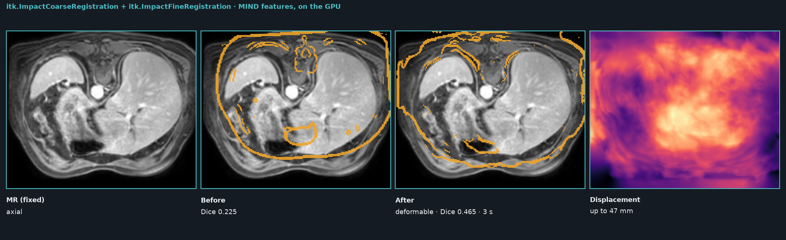

# ITKImpact examples

Four runnable scripts, each self-contained. Everything below runs from Python with no
`import torch` — the LibTorch inside your installed `torch` is reused by the wheel.

```bash
pip install itk-impact
```

You also need a TorchScript model. The ones used here come from the
[impact-torchscript-models](https://huggingface.co/VBoussot/impact-torchscript-models) collection:

```python
from huggingface_hub import snapshot_download
root = snapshot_download("VBoussot/impact-torchscript-models")
# root/TS/M291.pt        TotalSegmentator organs, 3D, 1 channel, 8 layers
# root/MRSeg/MRSeg.pt    MRSegmentator, 3D, 1 channel
# root/MIND/R1D2_3D.pt   MIND descriptor, 3D — no training, useful across modalities
# root/SAM2.1/…, root/Dino/…, root/VGG/…   2D encoders, 3 channels
```

Give the models **raw intensities** — Hounsfield units for CT, raw signal for MR. The
normalisation is baked into the TorchScript export; doing it yourself a second time gives an
empty result.

---

## 1. Inference — one pass, every layer

[`ImpactInferenceExample.py`](ImpactInferenceExample.py)

`itk.ImageToFeaturesMap` turns any patch-based TorchScript model into an ITK filter: an image
goes in, an `itk.VectorImage` comes out per layer you asked for. A single forward pass exposes
the whole hierarchy — mid-level features and, for a segmentation network, the final class
logits — because the `layersMask` selects which layers are kept.



```python
import itk

image = itk.imread("ct.nii.gz", itk.F)

mask = [False] * 8
mask[2] = True          # a mid-level feature layer
mask[7] = True          # the final logits

config = itk.ModelConfiguration(
    "TS/M291.pt",       # model
    3,                  # dimension the model expects
    1,                  # input channels
    [128, 128, 128],    # patch size
    [1.5, 1.5, 1.5],    # voxel size the model was trained at, per IMAGE axis
    32,                 # overlap between patches, in voxels
    mask,
    False,              # mixed precision
)
config.SetPatchCombine("gaussian")   # nnU-Net's blend window

ImageType = itk.Image[itk.F, 3]
features = itk.ImageToFeaturesMap[
    ImageType, itk.BSplineInterpolateImageFunction[ImageType, itk.D, itk.F]
].New()
features.SetModelConfiguration(config)
features.SetDevice("cuda:0")     # or "cpu"
features.AddInput(image)
features.Update()

feature_map = features.GetOutput(0)   # 128 channels at 6 mm
logits      = features.GetOutput(1)   # 25 channels at 1.5 mm
```

Kept layers come out **in model order**, whatever their index: `GetOutput(0)` is the first
`True` in the mask.

### Patch tiling

The volume is resampled to the model's voxel size and cut into overlapping patches; each patch
is weighted by a blend window and accumulated, so the assembled map lies on the resampled grid
whatever the overlap. Four windows are available through `SetPatchCombine`:

| window | what it does | use it for |
|---|---|---|
| `cosinus` *(default)* | raised-cosine taper, an exact partition of unity | feature maps |
| `gaussian` | nnU-Net's importance weighting | reproducing TotalSegmentator / MRSegmentator |
| `mean` | plain average of the patches covering a voxel | a baseline |
| `trim` | keeps each patch's central band instead of averaging | a label map, where averaging would invent classes between classes |

A larger overlap costs patches and buys accuracy near the patch borders, where the model has
least context. Against the official TotalSegmentator on an abdominal CT, macro Dice goes
0.823 → 0.877 → 0.889 → 0.892 for overlaps 0 / 16 / 32 / 64. The overlap can also be set per
axis, which is what an anisotropic patch needs:

```python
config.SetOverlaps([32, 32, 16])
```

A patch size of `0` on every axis runs the whole image in one pass, which is exact and fine for
small volumes.

The same tiling serves the registration filters: `ImpactCoarseRegistration` and
`ImpactFineRegistration` read the patch size and overlap of the configurations you give them, so
a model can be run over a volume that does not fit whole, with its trained field of view. The one
exception is the fine stage's differentiable-feature mode, which re-runs the network inside the
Adam loop and keeps the whole volume so the autograd graph stays a single piece.

---

## 2. Segmentation — the last layer, arg-maxed

[`MakeExampleImages.py`](MakeExampleImages.py) regenerates the figures on this page, and doubles
as a worked example: the last layer of a segmentation network is a stack of class logits, so
`numpy.argmax` over the channel axis is the label map.



```python
import numpy as np

logits = features.GetOutput(1)
labels = np.argmax(itk.array_view_from_image(logits), axis=-1).astype(np.uint8)

label_image = itk.image_from_array(labels)
label_image.CopyInformation(logits)     # same grid, spacing, origin and direction
itk.imwrite(label_image, "segmentation.nii.gz")
```

The map lands on the model's resampled grid, not the input's — resample it back if you need the
original sampling. Run it yourself with:

```bash
./MakeExampleImages.py TS/M291.pt ct.nii.gz --outdir images
```

### A 2D model on a 3D volume

`SAM2.1`, `DINOv2` and `VGG` are 2D networks. Applied to a volume they are swept over it, one
slice at a time along the last image axis; the swept axis keeps its extent and its spacing.
Declare the patch size on the model's axes and the voxel size on the image's:

```python
config = itk.ModelConfiguration(
    "SAM2.1/SAM2.1_Small.pt", 2, 3, [128, 128], [1.5, 1.5, 3.0], 32, [True], False
)
```

---

## 3. Similarity metric — registration in feature space

[`ImpactMetricExample.py`](ImpactMetricExample.py) · [`ImpactMetricExample.cxx`](ImpactMetricExample.cxx)

`itk.ImpactImageToImageMetricv4` compares images through features rather than intensities and
plugs straight into `itk.ImageRegistrationMethodv4` — only the comparison changes. Driven by the
modality-invariant MIND descriptor with an NCC distance, it aligns an abdominal **CT to an MR**.



Measured on Learn2Reg AbdomenMRCT case 1, with a known 12 / −8 / 6 mm and ~4° misalignment
applied to the CT so that there is something to recover: organ Dice **0.225 → 0.355**, against
the 0.422 the pair reaches when perfectly aligned — so roughly two thirds of the offset is taken
back, in 54 s on one GPU.

Two things decide whether this works at all, and both are easy to get wrong:

**Give the metric a mask.** Air agrees between modalities everywhere, so a whole-image domain
measures mostly background. On this pair the similarity varies by 1e-4 over a two-centimetre
offset without a mask — no optimizer can follow that — against 5e-2 inside the body.

```python
mask = itk.ImageMaskSpatialObject[3].New()
mask.SetImage(itk.imread("body_mask.nii.gz", itk.UC))
mask.Update()
metric.SetFixedImageMask(mask)
```

**Let ITK estimate the optimizer scales.** The rotation-versus-translation ratio depends on the
metric's own gradient magnitude; guessing it by hand walks the transform off the image.

```python
estimator = itk.RegistrationParameterScalesFromPhysicalShift[type(metric)].New()
estimator.SetMetric(metric)
optimizer.SetScalesEstimator(estimator)
```

Two modes:

- **`Static`** — feature maps are computed once per resolution level and then interpolated.
  Fast, and what you want for a large model.
- **`Jacobian`** — a patch is extracted around every sampled point at each iteration and the
  gradient is backpropagated through the model. Slower, but nothing is precomputed, so the model
  sees the moving image as the transform currently places it.

---

## 4. ConvexAdam deformable — dense registration on the GPU

[`ImpactConvexAdamExample.py`](ImpactConvexAdamExample.py)

`itk.ImpactCoarseRegistration` builds a coarse displacement field from a cost volume, then
`itk.ImpactFineRegistration` refines it with Adam on the same features — a dense, multi-modal
deformable registration entirely on the GPU.



On the same case and the same misalignment: organ Dice **0.225 → 0.465 in 3 s**, i.e. past the
0.422 a rigid transform can reach, because the field also takes up the deformation between the
two acquisitions. Left to their own initialisation the two filters recover **0.563 → 0.810** on
the organs present in both images.

Leaving the model configuration empty makes both filters fall back to a raw-intensity (MSE)
similarity, which is a useful baseline to compare against.

Both figures are regenerated by [`MakeRegistrationImages.py`](MakeRegistrationImages.py), which
also prints the per-organ Dice.

---

## Data used on this page

The CT is case `pair_0001_0004` of [AMOS22](https://amos22.grand-challenge.org/), the CT–MR pair
comes from [SynthRAD2023](https://synthrad2023.grand-challenge.org/). Any CT works — pass your
own to the scripts.

Figures are produced with matplotlib, which the module itself does not depend on:

```bash
pip install matplotlib
```
